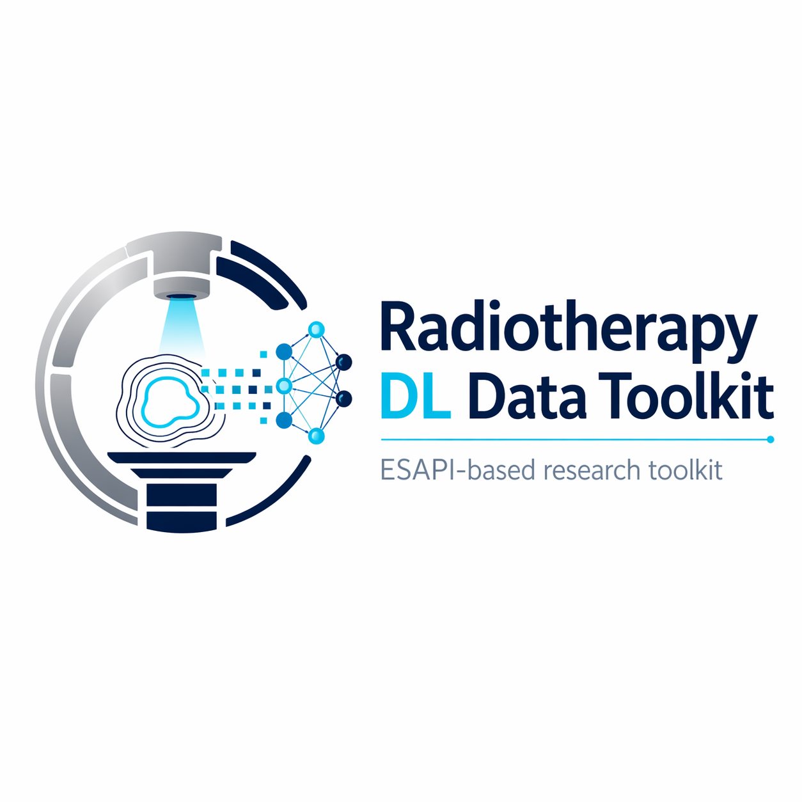
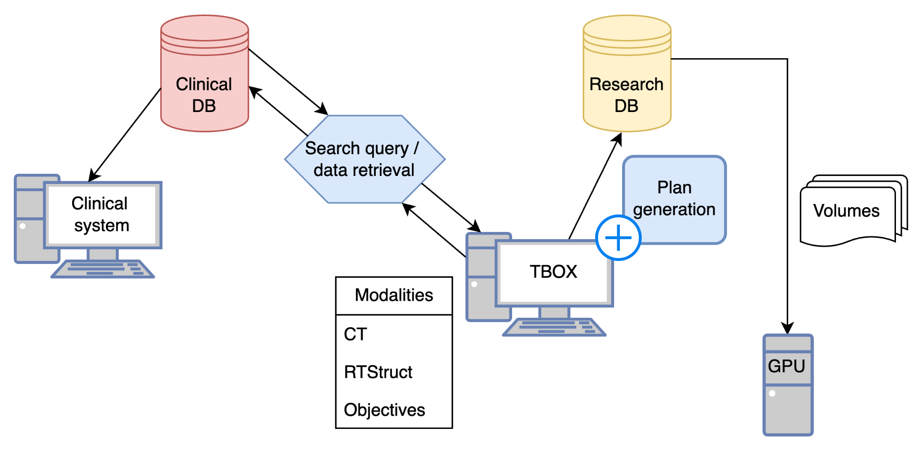

<p align="center">
  
</p>

<h1 align="center">Radiotherapy DL Data Toolkit</h1>

<p align="center">
  ESAPI-based research toolkit for transforming clinical radiotherapy plans into anonymised, deep-learning-ready datasets.
</p>

<p align="center">
  <strong>Clinical RT plans</strong> → <strong>cohort selection</strong> → <strong>DICOM retrieval</strong> → <strong>research plan reconstruction</strong> → <strong>GPU-ready arrays</strong>
</p>

---

## Why this repository exists

When this work started, there was no single ready-made library or package that could take clinical radiotherapy plans from a treatment planning environment and turn them into anonymised, structured, research-ready inputs for deep learning. We therefore built this toolkit to bridge that gap.

This repository packages the workflow used to move from clinically approved radiotherapy data to a reproducible research representation that can be used for downstream model development. The aim is to lower the technical barrier for other researchers who want to start from real clinical plans rather than rebuild the entire data bridge from scratch.

The public repository is intentionally sanitised. All server names, AE titles, usernames, passwords, file paths, patient identifiers, and institution-specific values have been replaced with placeholders and must be configured locally.

## End-to-end workflow

<p align="center">
  
</p>

The toolkit is organised around the main steps required to convert clinical radiotherapy plans into deep-learning-ready research data:

1. **Data search and cohort identification**  
   Query ARIA/SQL and define the patient cohort of interest.

2. **Data transfer and retrieval workflow**  
   Retrieve the required DICOM radiotherapy objects using C-FIND and C-MOVE.

3. **Plan generation**  
   Extract planning parameters from the original clinical plan, recreate the plan in a research ESAPI environment, optimise it, and export structured outputs for GPU-based downstream processing.

## What the toolkit provides

This repository demonstrates how to:

- identify a clinically meaningful cohort from the oncology information system,
- map selected plans and studies to the required RT objects,
- retrieve CT, RTSTRUCT, RTPLAN, RTDOSE, and related DICOM objects into a research environment,
- extract planning parameters from the original treatment plan,
- recreate and optimise a research version of the plan in ESAPI,
- export volumes and derived arrays for deep learning workflows.


## Repository structure

```text
radiotherapy-dl-data-toolkit/
├── 01_data_search_and_cohort_identification/
│   ├── aria_access.py
│   ├── filtered_records.example.csv
│   ├── query_aria_cohort.py
│   └── README.md
├── 02_data_transfer_and_retrieval_workflow/
│   ├── dicom_nodes.example.json
│   ├── move_patient_data.cs
│   └── README.md
├── 03_plan_generation/
│   ├── 01_extraction_of_planning_parameters_from_the_clinical_plan/
│   │   ├── extract_plan_parameters.py
│   │   ├── parameters.example.txt
│   │   └── README.md
│   ├── 02_plan_setup_and_optimisation/
│   │   ├── rebuild_baseline_plan.cs
│   │   ├── reconstruction.example.yaml
│   │   └── README.md
│   ├── 03_export_to_gpu_server_and_research_image_reconstruction/
│   │   ├── export_research_plan_to_gpu.py
│   │   ├── gpu_export_config_template.py
│   │   ├── gpu_export_utils.py
│   │   └── README.md
│   └── README.md
├── figures/
│   ├── radiotherapy_dl_data_toolkit_logo.png
│   ├── workflow_diagram.png
│   └── workflow_diagram.svg
├── .gitignore
├── README.md
└── requirements.txt
```


## Environment and setup

This toolkit assumes a **research Eclipse/ESAPI environment**, not a generic Python-only env.

See `requirements.txt` for the practical environment notes, including:
- research instance expectations,
- Eclipse and ESAPI prerequisites,
- writable-script requirement,
- Visual Studio / script-launch workflow,
- Python package dependencies.
